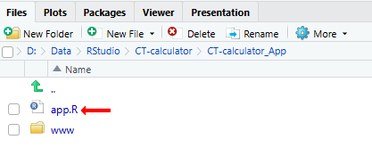
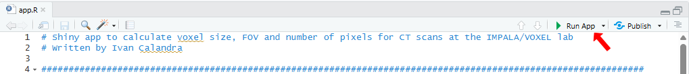
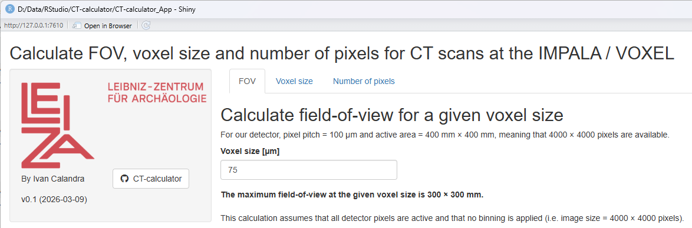
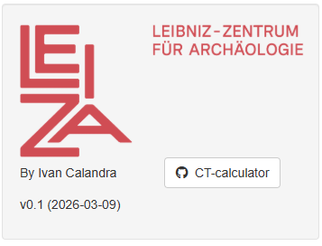
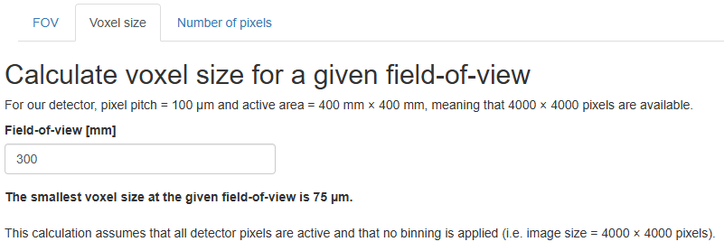
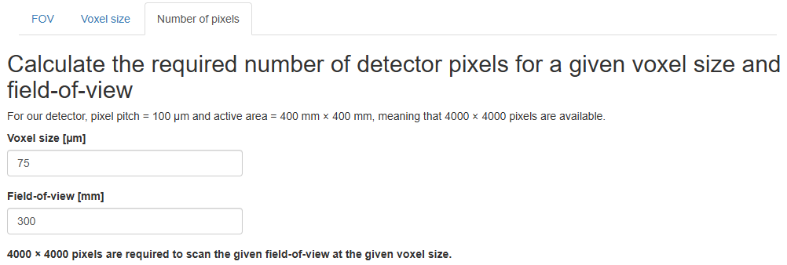
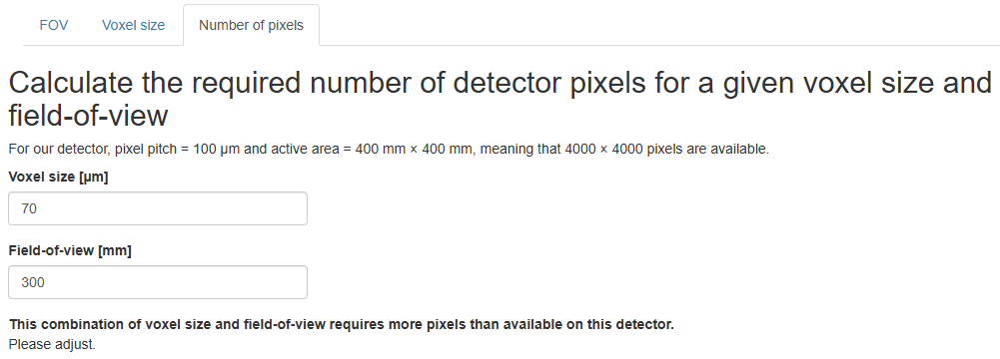

<!-- TOC ignore:true -->
# CT-calculator_App

<!-- TOC ignore:true -->
## Table of content

<!-- TOC -->

- [Purpose](#purpose)
- [How to use the App](#how-to-use-the-app)
    - [On the LEIZA server](#on-the-leiza-server)
    - [Locally with RStudio](#locally-with-rstudio)
        - [Pre-requisites](#pre-requisites)
        - [Download the repository](#download-the-repository)
        - [Start the App](#start-the-app)
    - [Saving](#saving)
- [Calculation](#calculation)
- [Operating instructions](#operating-instructions)
    - [Side bar](#side-bar)
    - [Tab "FOV"](#tab-fov)
    - [Tab "Voxel size"](#tab-voxel-size)
    - [Tab "Number of pixels"](#tab-number-of-pixels)
- [How to adapt the App](#how-to-adapt-the-app)
- [How to contribute](#how-to-contribute)
- [License](#license)

<!-- /TOC -->

---

*The releases are available and citable on Zenodo* **(TO ADJUST)**  

---

# Purpose

This repository contains a [**Shiny App**](CT-calculator_App/app.R) to calculate field-of-view, voxel size and number of pixels of CT scans acquired at the [IMPALA](https://www.leiza.de/forschung/infrastrukturen/labore/impala) / [VOXEL](https://www.leiza.de/forschung/infrastrukturen/labore/voxel-labor-fuer-volumetric-x-ray-examinations-at-leiza). 

Some settings are dependent on the detector, meaning that the calculations are only valid for CT scanners with a detector similar to the one on our Phoenix v|tome|x L450 CT scanner, with pixel size = 100 µm and active area = 400 $\times$ 400 mm.

If you would like to adapt the App to your needs, check the sections [How to adapt the App](#how-to-adapt-the-app), [How to contribute](#how-to-contribute) and [License](#license).

---

# How to use the App

## On the LEIZA server
**The easiest is to run the App on the LEIZA server:** https://tools.leiza.de/xxx/ **(TO ADJUST)**

## Locally with RStudio
Alternatively, the App can also be run locally using RStudio.  
This option is especially useful if you intend to edit the App (see sections [How to adapt the App](#how-to-adapt-the-app) and [How to contribute](#how-to-contribute)).

### Pre-requisites
The Shiny App is written in [Shiny](https://shiny.posit.co/) using [RStudio](https://posit.co/products/open-source/rstudio/), so you first need to download and install [R](https://www.r-project.org/) and [RStudio](https://posit.co/download/rstudio-desktop/). But fear not, **no knowledge of R/Rstudio is needed to run the App**!

### Download the repository
There are two ways to get the App: 
1. Download my [GitHub repository](https://github.com/ivan-paleo/CT-calculator/archive/refs/heads/main.zip) or its latest [release](https://github.com/ivan-paleo/CT-calculator/releases) as a ZIP archive, and unzip it. You can access the repository with the source code by clicking on the button in the side bar of the App (see [side bar](#side-bar)).  
2. [Fork and clone](https://happygitwithr.com/fork-and-clone.html) my [GitHub repository](https://github.com/ivan-paleo/CT-calculator).

### Start the App
1.  Open the file [CT-calculator.Rproj](CT-calculator.Rproj) with RStudio.
2.  Open the file `\CT-calculator_App\app.R` from within RStudio by clicking on it in the `Files` panel.

>

>     
>    <i>Open the App from within RStudio.</i>
>

3.  Run the App by clicking on the button `Run App` in the top right corner.

>

>     
>    <i>Run the App from within RStudio.</i>
>

4.  The App will open in a new RStudio window. I recommend to open the App in your browser (click on `Open in Browser` at the top to open the App), and to maximize the window (or at least make it large enough so that the fields do not overlap).

>

>     
>    <i>App freshly opened.</i>
>

5.  Enter the information as explained in the following section ([Operating instructions](#operating-instructions)).

## Saving
**In both cases (LEIZA server and local), no input is saved in the App.** If you close the App (or the browser tab), all input and output will be deleted.  

---

# Calculation
The following relationships are used in the app:

$FOV(mm) = \frac{DetectorArea(mm) \times VoxelSize(µm)}{PixelPitch(µm)} = \frac{DetectorArea(mm)}{Magnification}$

$VoxelSize(µm) = \frac{FOV(mm) \times PixelPitch(µm)}{DetectorArea(mm)} = \frac{PixelPitch(µm)}{Magnification}$

$\#pixels = \frac{FOV(mm)}{VoxelSize(µm)} \times 1000 = \frac{DetectorArea(mm)}{PixelPitch(µm)} \times 1000$

with $Magnification = \frac{ImageSize(mm)}{ObjectSize(mm)} = \frac{FDD(mm)}{FOD(mm)}$

---

# Operating instructions

## Side bar
Click the icon *CT-calculator* to open the repository on GitHub.

>

>     
>    <i>Sidebar.</i>
>

## Tab "FOV" 
In this tab, the field-of-view (FOV), assuming identical dimensions in X and Y, will be calculated for a given voxel size, assuming that all detector pixels are active and that no binning is applied (i.e. image size = 4000 $\times$ 4000 pixels).  
**Enter the desired voxel size (= resolution) in [µm]** in the field. The size of the FOV (= object dimensions) is updated automatically.

>

>     
>    <i>Tab "FOV".</i>
>

## Tab "Voxel size" 
In this tab, the voxel size is calculated for a given field-of-view (FOV), assuming that all detector pixels are active and that no binning is applied (i.e. image size = 4000 $\times$ 4000 pixels).  
**Enter the desired FOV (= largest object dimension along X and/or Y) in [mm]** in the field. The voxel size (= resolution) is updated automatically.

>

>     
>    <i>Tab "Voxel size".</i>
>

## Tab "Number of pixels" 
In this tab, the required number of detector pixels is calculated for a given combination of voxel size and field-of-view (FOV).  
**Enter the desired voxel size (= resolution) in [µm] and the desired FOV (= largest object dimension along X and/or Y) in [mm]** in the corresponding fields. The number of detector pixels (= image size) is updated automatically.

>

>     
>    <i>Tab "Number of pixels" with number calculated.</i>
>

Some combinations of voxel size and FOV would need more than 4000 pixels, i.e. more than possible with our detector. In these cases, an error message is displayed.

>

>     
>    <i>Tab "Number of pixels" with number not calculated.</i>
>

---

# How to adapt the App
I have tried to make the code of the App as clear as possible and to comment it as much as possible. This is surely not perfect, but I hope this will be enough for future developments and adaptations.

If you would like to adapt the App to your needs, feel free to do so on your own (see section [Download the repository](#download-the-repository)). Nevertheless, **I would appreciate if you would be willing to [contribute](#how-to-contribute)**! You can also get in touch with me directly.

---

# How to contribute
I appreciate any comment from anyone (expert or novice) to improve this App, so do not be shy!  
There are three possibilities to contribute.

1.  Submit an issue: If you notice any problem or have a question, submit an [issue](https://docs.github.com/en/issues/tracking-your-work-with-issues/learning-about-issues/about-issues). You can do so [here](https://github.com/ivan-paleo/CT-calculator/issues).  
2.  Propose changes: If you know how to write a [Shiny App](https://shiny.posit.co/), please propose text edits as a [pull request](https://docs.github.com/en/pull-requests/collaborating-with-pull-requests/proposing-changes-to-your-work-with-pull-requests/about-pull-requests) (abbreviated "PR").
3.  Send me an email: For options 1-2, you need to create a GitHub account. If you do not have one and do not want to sign up, you can still write me an email (Google me to find my email address).

By participating in this project, you agree to abide by our [code of conduct](CONDUCT.md).

---

# License

This work is licensed under a [Creative Commons Attribution-NonCommercial-ShareAlike 4.0 International License](http://creativecommons.org/licenses/by-nc-sa/4.0/). See [LICENSE](LICENSE).

Author: Ivan Calandra

---

*License badge, file and image from Soler S. cc-licenses: Creative Commons Licenses for GitHub Projects, <https://github.com/santisoler/cc-licenses>.*
